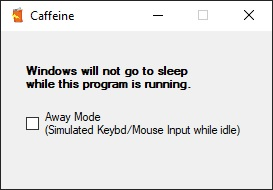

# Caffeine
Windows .NET application to prevent computer from going to sleep, and prevents "idle" status in other applications.

## Information:
- Can minimize to system tray.
- Prevents Windows from going to sleep while the program is running.
- Enabling afk mode will start a repeating timer for 45-65 seconds (random). If no input is received during this period of time, Caffeine will simulate a single random keypress (A-Z, 0-9), and move the mouse cursor to a random area on the primary monitor.
- Perfect to prevent yourself from going "Idle" or "Away" in applications like Teams/Skype/Slack.
